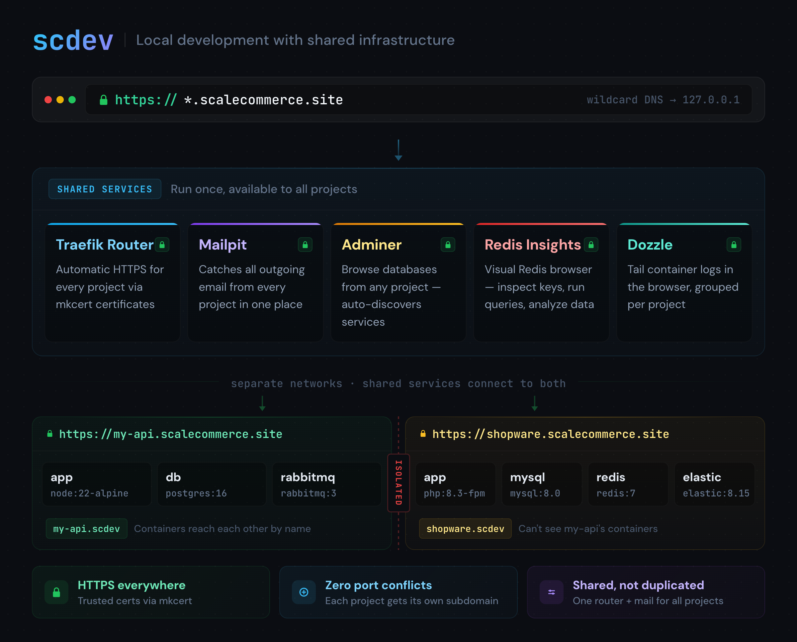

# scdev

**Ever seen a developer and an AI agent fall in love with a dev environment?** 🧑‍💻🤖❤️

scdev is a local development tool that gets you from `git clone` to coding in seconds. One command starts your entire project - HTTPS, routing, shared services, and all. Simple enough for any AI coding agent to operate, powerful enough for complex multi-service setups.

```bash
cd my-project
scdev start
# Your project is running at https://my-project.scalecommerce.site
```

> `scalecommerce.site` is a wildcard DNS pointing to `127.0.0.1` - everything runs locally on your machine. No cloud, no accounts. You can use your own domain.

**Requires:** [Docker Desktop](https://www.docker.com/products/docker-desktop/) (macOS/Windows) or Docker Engine (Linux)

## How It Works

Every project runs in its own isolated network. scdev gives each project its own HTTPS subdomain - no port conflicts, no SSL setup. Shared services like mail catching, database browsing, and Redis inspection are available to all projects automatically.



## Built for Coding Agents

scdev gives AI coding agents (Claude Code, Cursor, Copilot) exactly what they need: deterministic environments with zero ambiguity.

- **One command** - `scdev start` is all the agent needs. No multi-step setup to get wrong.
- **Predictable URLs** - The app is always at `https://{name}.scalecommerce.site`. No port guessing.
- **Single config file** - `.scdev/config.yaml` is the complete source of truth. One file to read, not five.
- **Discoverable commands** - `ls .scdev/commands/` reveals all project-specific tasks. No guessing.
- **`scdev exec app <cmd>`** - Run anything in any container. No container name lookup needed.

### Agent Integration

Install the scdev skill so your agent knows how to use the dev environment:

```bash
npx skills add scalecommerce-dev/scdev
```

This teaches your agent the full scdev CLI, config format, debugging workflows, and project setup patterns.

## Why scdev?

| Without scdev | With scdev |
|---------------|------------|
| Port conflicts between projects | Every project gets its own HTTPS subdomain |
| Each project configures its own mail, DB tools | Shared services run once, work for all projects |
| New developer spends a day setting up | Clone, `scdev start`, done |
| Complex Docker Compose with 100+ lines | Simple config with sensible defaults |
| Slow file sync on macOS | Native-speed file sync, zero config |

## Quick Start

### 1. Install

```bash
curl -fsSL https://raw.githubusercontent.com/ScaleCommerce-DEV/scdev/main/install.sh | sh
```

### 2. First-time setup

This installs SSL certificates and starts the shared services (router, mail catcher, DB browser):

```bash
scdev systemcheck
```

### 3. Create a project

Create a file at `my-app/.scdev/config.yaml`:

```yaml
name: my-app

services:
  app:
    image: node:20-alpine
    command: npm run dev
    working_dir: /app
    volumes:
      - ${PROJECTPATH}:/app    # mounts your project directory into the container
    routing:
      port: 3000
```

`${PROJECTPATH}` is resolved automatically to your project's absolute path. Other available variables: `${PROJECTNAME}`, `${PROJECTDIR}`, `${SCDEV_DOMAIN}`.

### 4. Start

```bash
cd my-app
scdev start
```

Open https://my-app.scalecommerce.site - that's it. HTTPS works out of the box with locally-trusted certificates.

## Shared Services

These run once and are shared across all your projects. No per-project configuration needed.

| Service | URL | What it does |
|---------|-----|--------------|
| Router | `https://router.shared.scalecommerce.site` | Routing dashboard - see all routes |
| Mail | `https://mail.shared.scalecommerce.site` | Catches all outgoing email ([Mailpit](https://github.com/axllent/mailpit)) |
| DB | `https://db.shared.scalecommerce.site` | Browse any project's database ([Adminer](https://www.adminer.org/)) |
| Redis | `https://redis.shared.scalecommerce.site` | Inspect Redis keys and data ([Redis Insights](https://redis.io/insight/)) |

Open them directly:

```bash
scdev mail    # open Mailpit
scdev db      # open Adminer
scdev redis   # open Redis Insights
```

## Features

### Automatic HTTPS

Every project and shared service gets locally-trusted HTTPS certificates. Your browser shows a green lock, cookies work with `Secure` flag, and your local environment matches production.

### Fast File Sync (macOS)

File sharing between your host and containers is notoriously slow on macOS. scdev automatically syncs files at native speed - no configuration needed. On Linux this isn't needed (already fast).

How much difference does it make? We benchmarked `pnpm install` on a Nuxt app:

| Approach | pnpm install | Dev server ready |
|----------|-------------|-----------------|
| Docker bind mount (default macOS) | **34.6s** | 7s |
| scdev with file sync | **4.9s** | 4s |

That's a **7x speedup** on dependency installation. The trick: scdev syncs your source code via fast file sync, while keeping `node_modules` inside the container where filesystem operations are native speed.

Exclude paths you don't need synced:

```yaml
mutagen:
  ignore:
    - node_modules
    - .nuxt
    - var/cache
```

### TCP/UDP Routing

Beyond HTTPS, scdev can expose raw TCP and UDP ports. This lets you connect to a database inside a project from your host using tools like DBeaver, pgAdmin, or `psql`:

```yaml
services:
  db:
    image: postgres:16-alpine
    environment:
      POSTGRES_PASSWORD: postgres
    routing:
      protocol: tcp
      port: 5432        # container port
      host_port: 5432   # exposed on localhost:5432
```

```bash
psql -h localhost -p 5432 -U postgres   # connect from your host
```

Multiple projects can expose different ports without conflicts. Works for MySQL, Redis, RabbitMQ, or any TCP/UDP service.

### Volumes

**Bind mounts** (`${PROJECTPATH}:/app`) sync your source code into the container. Edits on the host are reflected immediately. On macOS, scdev handles fast sync automatically.

**Named volumes** (`node_modules:/app/node_modules`) are persistent storage managed by scdev. Use these for dependencies, database files, and caches - things that are huge, change constantly, and would kill sync performance:

```yaml
volumes:
  - ${PROJECTPATH}:/app              # your source code (synced to host)
  - node_modules:/app/node_modules   # dependencies (stays in container, fast)
  - db_data:/var/lib/postgresql/data  # database files (persists across restarts)
```

Named volumes persist across `scdev stop`/`scdev start` and are removed with `scdev down -v`. No separate declaration needed - scdev discovers them automatically.

### Custom Commands

Every project has recurring tasks: install deps, run migrations, seed data, run tests. Instead of documenting these in a README, define them as [just](https://github.com/casey/just) files in `.scdev/commands/`. The filename becomes the command:

```
.scdev/commands/
  setup.just     ->  scdev setup
  test.just      ->  scdev test
  seed.just      ->  scdev seed
```

```bash
# .scdev/commands/setup.just
default:
    scdev exec app npm ci
    scdev exec app npx prisma db push

# .scdev/commands/test.just
default:
    scdev exec app npm test

watch:
    scdev exec app npm test -- --watch
```

```bash
scdev setup          # install deps + push schema
scdev test           # run tests
scdev test watch     # run tests in watch mode
```

Agents can `ls .scdev/commands/` to discover all available project tasks.

### Project Isolation

Each project runs in its own isolated network. Services within a project reach each other by name (`db`, `redis`, `app`), but projects can't see each other's services. The shared router bridges them to the outside.

## Commands

### Lifecycle

```bash
scdev start       # Start the project
scdev stop        # Stop containers (keeps them for quick restart)
scdev restart     # Stop + start
scdev down        # Remove containers and network
scdev down -v     # Remove everything including volumes
```

### Development

```bash
scdev exec app bash              # Shell into a container
scdev exec app npm test          # Run a command
scdev logs                       # View logs
scdev logs -f app                # Follow logs for a service
```

### Information

```bash
scdev info        # Show project info, URLs, services
scdev list        # List all projects
scdev config      # Show resolved configuration
scdev status      # Quick status check
```

### Shared Services

```bash
scdev services status    # Check shared service status
scdev services start     # Start shared services
scdev services stop      # Stop shared services
scdev services recreate  # Rebuild shared service containers
```

### File Sync (macOS)

```bash
scdev mutagen status  # Check sync status
scdev mutagen flush   # Wait for sync to complete
scdev mutagen reset   # Recreate sync sessions (if stuck)
```

## Examples

### PHP + MySQL

```yaml
name: my-shop

services:
  app:
    image: webdevops/php-nginx:8.2
    working_dir: /app
    volumes:
      - ${PROJECTPATH}:/app
    environment:
      WEB_DOCUMENT_ROOT: /app/public
      DATABASE_URL: mysql://root:root@db:3306/app
    routing:
      port: 80

  db:
    image: mysql:8.0
    volumes:
      - db_data:/var/lib/mysql
    environment:
      MYSQL_ROOT_PASSWORD: root
      MYSQL_DATABASE: app
```

### Node.js + PostgreSQL

```yaml
name: my-api

services:
  app:
    image: node:20-alpine
    command: npm run dev
    working_dir: /app
    volumes:
      - ${PROJECTPATH}:/app
      - node_modules:/app/node_modules
    environment:
      DATABASE_URL: postgres://postgres:postgres@db:5432/app
    routing:
      port: 3000

  db:
    image: postgres:16-alpine
    volumes:
      - db_data:/var/lib/postgresql/data
    environment:
      POSTGRES_PASSWORD: postgres
      POSTGRES_DB: app
```

### Static Site / Frontend

```yaml
name: my-docs

services:
  app:
    image: node:20-alpine
    command: npm run dev
    working_dir: /app
    volumes:
      - ${PROJECTPATH}:/app
    routing:
      port: 5173
```

## Configuration Reference

### Minimal config

```yaml
name: my-app

services:
  app:
    image: node:20-alpine
    command: npm run dev
    working_dir: /app
    volumes:
      - ${PROJECTPATH}:/app
    routing:
      port: 3000
```

### Full config with all options

```yaml
name: my-shopware-shop
domain: shop.scalecommerce.site  # defaults to {name}.scalecommerce.site

shared:
  router: true          # connect to shared router (default: true)
  mail: true            # connect to shared Mailpit
  db: true              # connect to shared Adminer
  redis_insights: true  # connect to shared Redis Insights

environment:            # available to all services
  APP_ENV: dev
  APP_DEBUG: "true"

services:
  app:
    image: php:8.2-fpm
    working_dir: /var/www
    command: php-fpm
    volumes:
      - ${PROJECTPATH}:/var/www
      - composer_cache:/root/.composer
    environment:
      DATABASE_URL: mysql://root:root@db:3306/shopware
    routing:
      protocol: http    # http, https, tcp, udp
      port: 9000

  db:
    image: mysql:8.0
    volumes:
      - db_data:/var/lib/mysql
    environment:
      MYSQL_ROOT_PASSWORD: root
      MYSQL_DATABASE: shopware

  redis:
    image: redis:7-alpine

mutagen:
  ignore:
    - var/cache
    - var/log
```

### Global config (`~/.scdev/global-config.yaml`)

Auto-created on first run. Usually you don't need to touch this.

```yaml
domain: scalecommerce.site
ssl:
  enabled: true
mutagen:
  enabled: auto  # enabled on macOS, disabled on Linux
```

## Troubleshooting

### "DNS doesn't resolve"

`scalecommerce.site` uses wildcard DNS pointing to `127.0.0.1`. If it doesn't work:

1. Check: `dig my-app.scalecommerce.site`
2. Corporate VPNs sometimes block external DNS - try a different network
3. Add entries to `/etc/hosts` as a workaround

### "Containers won't start"

```bash
scdev down           # clean up
scdev start          # try again
scdev logs -f app    # check what's happening
```

### "File sync is slow" (macOS)

```bash
scdev mutagen status   # check if Mutagen is running
scdev mutagen reset    # recreate sync sessions if stuck
```

### "Port already in use"

scdev uses ports 80 and 443 for the shared router. Check what's using them:

```bash
lsof -i :80
lsof -i :443
```

## Standing on the Shoulders of Giants

scdev doesn't reinvent the wheel. It orchestrates proven open-source tools into a seamless experience - so you get the power without the configuration.

| Technology | What scdev uses it for | Link |
|------------|----------------------|------|
| [Docker](https://www.docker.com/) | Container runtime, network isolation | docker.com |
| [Traefik](https://traefik.io/) | Reverse proxy - HTTPS routing, subdomains, TCP/UDP | traefik.io |
| [mkcert](https://github.com/FiloSottile/mkcert) | Locally-trusted SSL certificates | github.com/FiloSottile/mkcert |
| [Mutagen](https://mutagen.io/) | Fast file sync on macOS | mutagen.io |
| [just](https://github.com/casey/just) | Command runner for project tasks | github.com/casey/just |
| [Mailpit](https://github.com/axllent/mailpit) | Email testing - catches all outgoing mail | github.com/axllent/mailpit |
| [Adminer](https://www.adminer.org/) | Database browser - MySQL, PostgreSQL, SQLite | adminer.org |
| [Redis Insights](https://redis.io/insight/) | Redis browser - keys, queries, memory analysis | redis.io/insight |

## License

MIT
